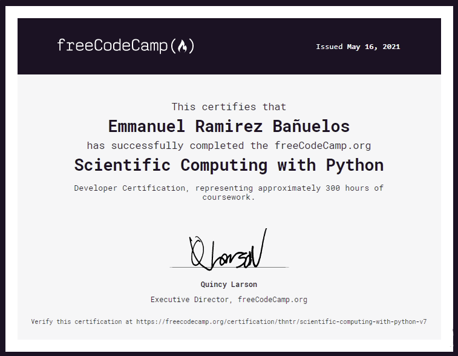

# Scientific Computing with Python
> Developer Certification, representing approximately 300 hours of coursework.
> You can view this official acreditation [_here_](https://www.freecodecamp.org/certification/thntr/scientific-computing-with-python-v7).

